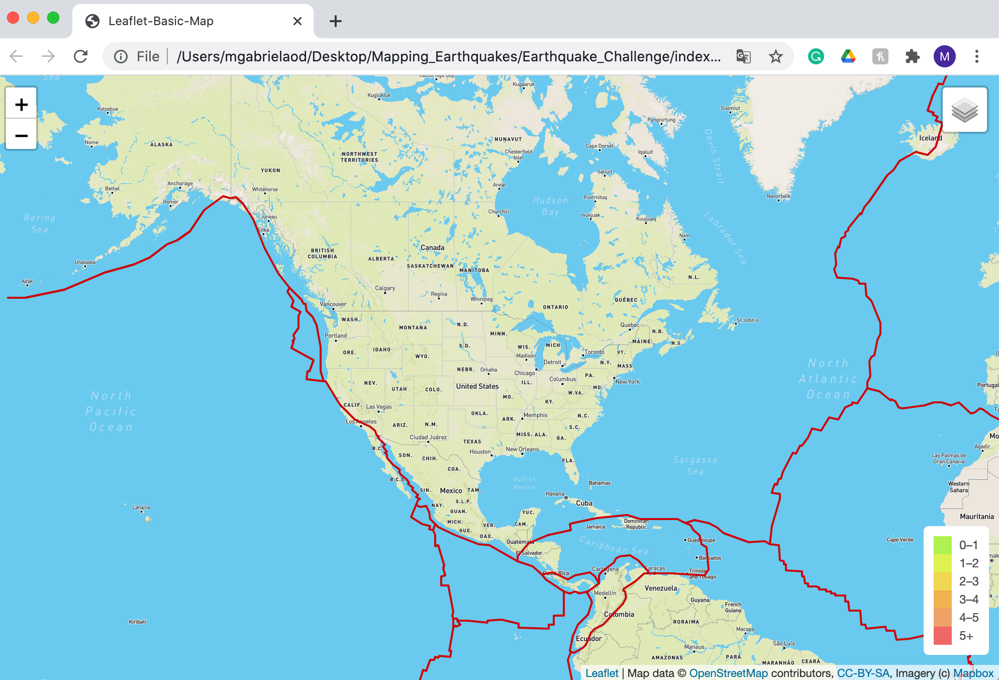
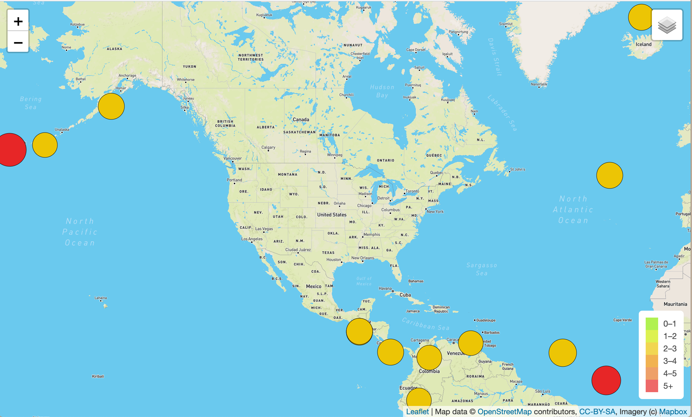
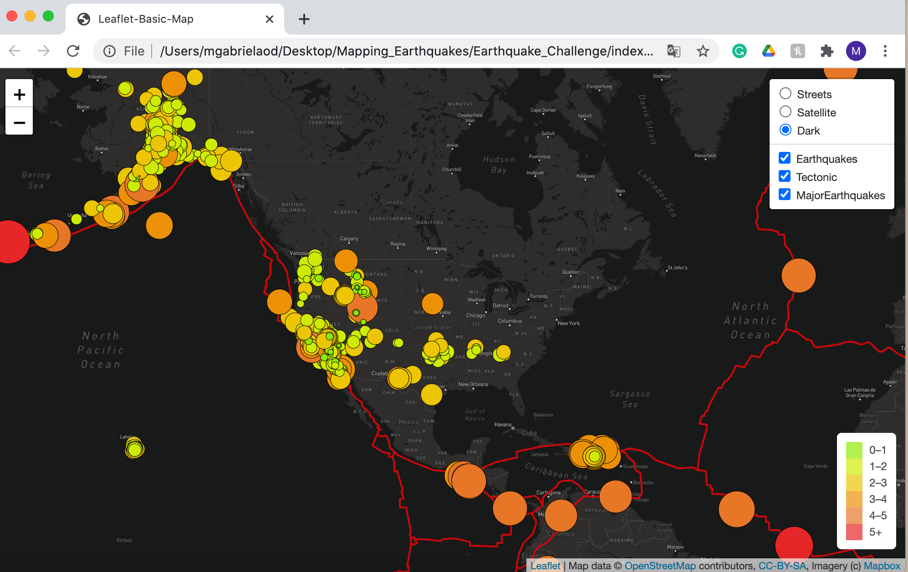

# Mapping_Earthquakes

## Overview of the Project 

In this project, we used the Leaflet.js Application Programming Interface (API) to populate a geographical map with GeoJSON earthquake data from a URL. Each earthquake is visually represented by a circle and color, where a higher magnitude has a larger diameter and is darker in color. In addition, each earthquake has a popup marker that, when clicked, shows the magnitude of the earthquake and the location of the earthquake.

## Results of the Project 

### Tectonic Plate Data 

### Major Earthquake Data 

### Dark Map addition 

